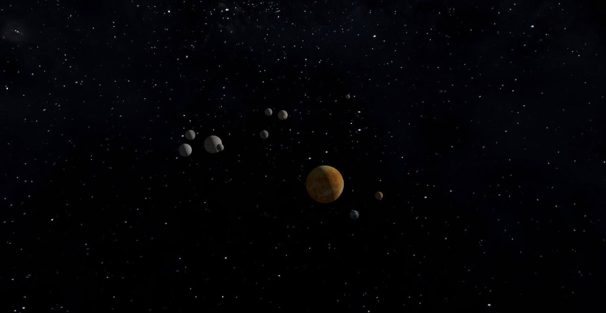

# My Own Solar System

My Own Solar System is a small Three.js project built with Vite. It renders a 3D solar system scene with textured planets, moons, camera controls, lighting, and a cubemap space background.

The project is part of the `ThreeJsPlayground` repository and is located in the `MyOwnSolarSystem/` folder.

## Live Demo

https://solar-system-project-myown.netlify.app/

## Preview

The project already contains a preview image in the `public/` folder:



## Features

- 3D solar system scene rendered with Three.js
- Sun mesh with texture
- Textured planet meshes:
  - Mercury
  - Venus
  - Earth
  - Mars
  - Jupiter
  - Saturn
  - Uranus
  - Neptune
- Moon objects attached to selected planets
- Earth with Moon
- Mars with Phobos and Deimos
- Jupiter with Io, Europa, Ganymede, and Callisto
- Saturn with Titan and Enceladus
- Uranus with Miranda and Titania
- Neptune with Triton
- Planet movement around the scene using individual speed and distance values
- Moon movement around parent planets
- OrbitControls for interactive camera movement
- Camera damping enabled for smoother controls
- Ambient light and directional light
- Cubemap space background
- Responsive canvas resize handling
- Fullscreen canvas layout with hidden page overflow

## Tech Stack

- JavaScript
- Three.js
- Vite
- CSS

## Project Structure

```txt
ThreeJsPlayground/
└── MyOwnSolarSystem/
    ├── public/
    │   ├── cubeMaps/
    │   ├── textures/
    │   └── preview.png
    │
    ├── src/
    │   ├── js/
    │   │   └── index.js
    │   └── styles/
    │       └── style.css
    │
    ├── index.html
    ├── netlify.toml
    ├── package.json
    └── package-lock.json
```

## Getting Started

### Prerequisites

Make sure you have installed:

- Node.js
- npm

## Installation

Clone the repository:

```bash
git clone https://github.com/AcePeQ/ThreeJsPlayground.git
cd ThreeJsPlayground/MyOwnSolarSystem
```

Install dependencies:

```bash
npm install
```

Run the development server:

```bash
npm run dev
```

Build the project:

```bash
npm run build
```

Preview the production build:

```bash
npm run preview
```

## Available Scripts

Run these commands inside the `MyOwnSolarSystem/` folder:

```bash
npm run dev      # Start Vite development server
npm run build    # Build the project for production
npm run preview  # Preview the production build
```

## How It Works

The main scene logic is located in:

```txt
src/js/index.js
```

The app creates:

- a Three.js scene
- a perspective camera
- OrbitControls
- texture loaders for planet textures
- a cubemap background
- one shared `IcosahedronGeometry`
- planet and moon meshes based on object configuration
- ambient and directional lights
- a WebGL renderer attached to the `#canvas` element
- a render loop using `requestAnimationFrame`

Planet and moon movement is handled inside the render loop by updating rotation and position values with `Math.sin()` and `Math.cos()`.

## Notes

This is a visual Three.js experiment rather than a full application. It does not include routing, a backend, user accounts, real astronomical scale, real orbital physics, or UI controls for changing simulation settings.

The Saturn ring texture is present in the code, but there is no rendered Saturn ring mesh in the current implementation.

## Deployment

The project includes a `netlify.toml` file with a redirect rule to `index.html`, so it can be deployed as a static Vite project.


## Author

Created by [AcePeQ](https://github.com/AcePeQ).
